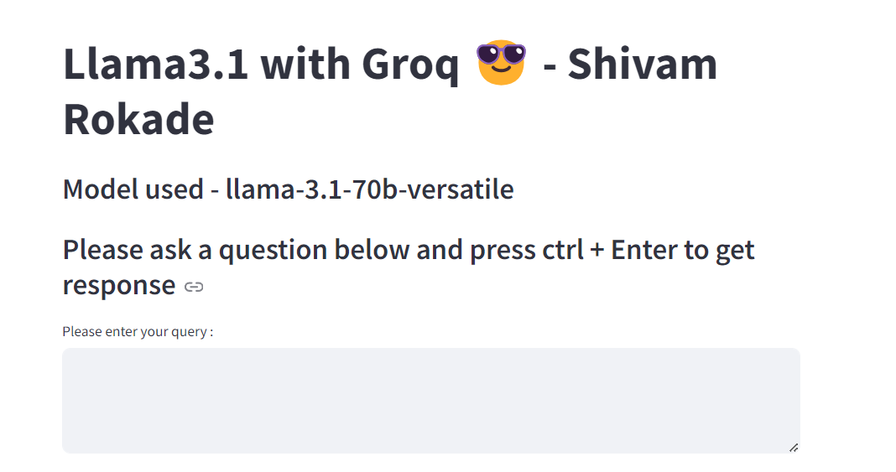

<h1 align="center">LLama3.1</h1>

This project showcases the implementation of the LLama3.1 large language model, utilizing the Groq platform for efficient execution. The model is deployed and made accessible through a Streamlit web application, allowing users to interact with the language model directly from their browser. 

#### Key Features: 
The dataset used in this project contains the following features: 
• LLama3.1 Model: A powerful large language model designed for various natural language processing tasks. 
• Groq Integration: Leveraging Groq's hardware capabilities to run the model efficiently.
 
• Streamlit Web App: A user-friendly interface that enables interaction with the model for generating text, answering questions, and more. 

#### Project Overview: 

• Model Deployment: The LLama3.1 model is deployed using Groq, ensuring optimized performance for handling large-scale language tasks. 
Web Interface: A Streamlit app is developed to provide an accessible and interactive experience, where users can input queries and receive responses from the model. 

#### How to Run the Project:  
• Clone the repository. 
• Install the required dependencies. 
• Run the Streamlit app to interact with the LLama3.1 model on the web. 
